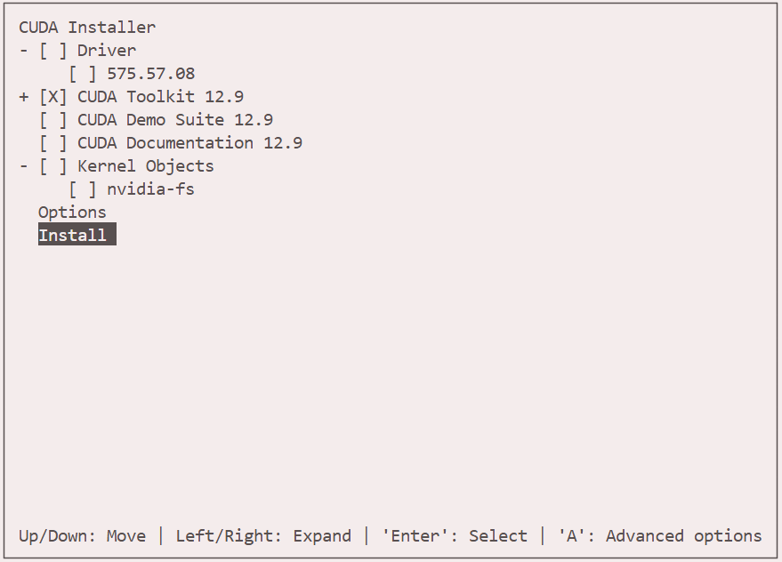

# **OpenSUSE（无sudo）下安装SIRF-SuperBuild（STIR）** STIR

note 没单独说用conda环境就不要用，以免conda环境找不到已经安装好的相关依赖包

## 1 cmake安装

系统不自带cmake，但自带cmake依赖，如gcc，make，openssl

cmake官网下载sh预编译文件，自己编译要cmake命令，搁这鸡生蛋蛋生鸡

```bash
wget https://github.com/Kitware/CMake/releases/download/v3.23.0/cmake-3.23.0-linux-x86_64.sh 

mkdir -p $HOME/software/cmake-3.23.0 

sh cmake-3.23.0-linux-x86_64.sh --prefix=$HOME/software/cmake-3.23.0 --skip-license

export PATH="$HOME/software/cmake-3.23.0/bin:$PATH" # 添加到。~.bashrc
source ~/.bashrc

cmake --version # 测试成功

```


## 2 cuda-tookit安装

同样只能runfile形式，也就是预编译形式，官网指导[在此]([CUDA Toolkit 12.9 Update 1 Downloads | NVIDIA Developer](https://developer.nvidia.com/cuda-downloads?target_os=Linux&target_arch=x86_64&Distribution=OpenSUSE&target_version=15&target_type=runfile_local))

```bash
wget https://developer.download.nvidia.com/compute/cuda/12.9.1/local_installers/cuda_12.9.1_575.57.08_linux.run

sh cuda_12.9.1_575.57.08_linux.run --installpath=$HOME/software/cuda-tookit
```

出现如下agreement，accept


CUDA Toolkit里的选项都不要选，涉及到系统目录，没权限


Driver不要选，需要root权限，而且选好显卡节点后自动有驱动



安装好后界面如下：


路径加到bashrc

```bash
export PATH="$HOME/software/cuda-tookit/bin:$PATH"
```


## 3 openssl\curl安装

由于curl安装需要openssl的动态库，但是系统自带的库无法拿到(root原因)，需要自己装openssl

```bash
cd ~/packages
wget https://www.openssl.org/source/openssl-3.4.2.tar.gz
tar -xzf openssl-3.4.2.tar.gz
cd openssl-3.4.2

mkdir -p $HOME/software/openssl-3.4.2
./config --prefix=$HOME/software/openssl-3.4.2 --openssldir=$HOME/software/openssl-3.4.2 shared zlib
make -j8
make install
export PATH="$HOME/software/openssl-3.4.2/lib64:$PATH"
export PATH="$HOME/software/openssl-3.4.2/bin:$PATH"
export PATH="$HOME/software/openssl-3.4.2/include:$PATH"
export PATH="$HOME/software/openssl-3.4.2/share:$PATH"

source ~/.bashrc

```

curl安装

```
wget https://curl.se/download/curl-7.80.0.tar.gz
tar -zxvf curl-7.80.0.tar.gz
cd ../curl-7.80.0/
./configure --prefix=/home/fanghaodu/software/curl-7.80.0 --with-openssl=$HOME/software/openssl-3.4.2
```

configure成功截图


```bash
make -j8
make install

export CURL_ROOT="$HOME/software/curl-7.80.0"
export CMAKE_PREFIX_PATH=$CURL_ROOT:$CMAKE_PREFIX_PATH
export LIBRARY_PATH=$CURL_ROOT/lib64:$LIBRARY_PATH
export LD_LIBRARY_PATH=$CURL_ROOT/lib64:$LD_LIBRARY_PATH
export CPATH=$CURL_ROOT/include:$CPATH


curl -version
```


## 4 python安装

服务器自带的3.6版本有点低了，而且cmake配饰SIRF的时候说找不到python开发组件

重装一下python，并指定路径

```bash
cd ~/packages
wget https://www.python.org/ftp/python/3.12.6/Python-3.12.6.tar.xz
tar -xf Python-3.12.6.tar.xz
cd Python-3.12.6
./configure --prefix=$HOME/software/python-3.12.6 --enable-optimizations CFLAGS="-fPIC" --with-openssl=$HOME/software/openssl-3.4.2
make -j8 #最多就8、
make install

export PATH="$HOME/software/python-3.12.6/bin:$PATH" # .bashrc
export PATH="$HOME/software/python-3.12.6/inculde:$PATH"
export PATH="$HOME/software/python-3.12.6/lib:$PATH"
alias python=python3 #改下别名

# make distclean  清理方式

```


## 5 go 安装

编译过程中需要go

```bash
wget https://go.dev/dl/go1.24.5.linux-386.tar.gz
sudo tar -C $HOME/software/ -xzf go1.24.5.linux-386.tar.gz
export PATH="$HOME/software/go/bin"$PATH

source ~/.bashrc
```


## 6 BLAS

```bash
cd ~/packages
git clone https://github.com/xianyi/OpenBLAS.git
cd OpenBLAS

cmake . -DCMAKE_INSTALL_PREFIX=$HOME/software/openblas -DBUILD_SHARED_LIBS=ON
make   -j$(nproc)
make PREFIX=$HOME/software/openblas install

export OPENBLAS_ROOT="$HOME/software/openblas"
export CMAKE_PREFIX_PATH=$OPENBLAS_ROOT:$CMAKE_PREFIX_PATH
export CPATH=$OPENBLAS_ROOT/include:$CPATH
export LIBRARY_PATH=$OPENBLAS_ROOT/lib:$LIBRARY_PATH
export LD_LIBRARY_PATH=$OPENBLAS_ROOT/lib:$LD_LIBRARY_PATH

```


##  7 LAPACKE

```bash
cd ~/packages
git clone https://github.com/Reference-LAPACK/lapack.git
cd lapack && mkdir build && cd build
cmake -DLAPACKE=ON -DBUILD_SHARED_LIBS=ON -DCMAKE_INSTALL_PREFIX=$HOME/software/lapack ..
make -j$(nproc) && make install
```


## 8 pugixml安装

```bash
git clone https://github.com/zeux/pugixml.git
cd pugixml
mkdir build
cd build
cmake .. -DCMAKE_INSTALL_PREFIX=/home/fanghaodu/software/pugixml
make -j8
make install

export PUGIXML_ROOT="$HOME/software/pugixml"
export CMAKE_PREFIX_PATH=$PUGIXML_ROOT:$CMAKE_PREFIX_PATH
export CPATH=$PUGIXML_ROOT/include:$CPATH
export LIBRARY_PATH=$PUGIXML_ROOT/lib:$LIBRARY_PATH
export LD_LIBRARY_PATH=$PUGIXML_ROOT/lib:$LD_LIBRARY_PATH

```


## 9 date安装

```bash

mkdir build
cd build
cmake -DENABLE_DATE_TESTING=ON -DBUILD_TZ_LIB=ON -DCMAKE_INSTALL_PREFIX=$HOME/software/date ../
cmake --build . --target testit -- -j8

export DATE_ROOT="$HOME/software/date"
export CMAKE_PREFIX_PATH=$DATE_ROOT:$CMAKE_PREFIX_PATH
export CPATH=$DATE_ROOT/include:$CPATH
export LIBRARY_PATH=$DATE_ROOT/lib64:$LIBRARY_PATH
export LD_LIBRARY_PATH=$DATE_ROOT/lib64:$LD_LIBRARY_PATH
```

## 10 armdillo

```bash
下载url：https://arma.sourceforge.net/download.html

tar -Jvzf armadillo-14.6.1.tar.xz
cd armadillo-14.6.1
mkdir build
cd build
cmake -DCMAKE_INSTALL_PREFIX=$HOME/software/date ../
make -j8

export DATE_ROOT="$HOME/software/armadillo-14.6.1"
export CMAKE_PREFIX_PATH=$DATE_ROOT:$CMAKE_PREFIX_PATH
export CPATH=$DATE_ROOT/include:$CPATH
export LIBRARY_PATH=$DATE_ROOT/lib64:$LIBRARY_PATH
export LD_LIBRARY_PATH=$DATE_ROOT/lib64:$LD_LIBRARY_PATH
```


## 11 FFTW3

```bash
https://fftw.org/ #必须是release版本，否则缺符号链接

wget https://fftw.org/fftw-3.3.10.tar.gz
camke流程
注意单精度双精度都要编译，默认是单精度，先编译一遍；再enable float编译一遍

export FFTW_ROOT="$HOME/software/fftw-3.3.10"
export CMAKE_PREFIX_PATH=$FFTW_ROOT:$CMAKE_PREFIX_PATH
export CPATH=$FFTW_ROOT/include:$CPATH
export LIBRARY_PATH=$FFTW_ROOT/lib64:$LIBRARY_PATH
export LD_LIBRARY_PATH=$FFTW_ROOT/lib64:$LD_LIBRARY_PATH
```


## 12 openmpi （分布式计算包）

```bash
wget https://download.open-mpi.org/release/open-mpi/v4.1/openmpi-4.1.8.tar.gz
进configure改prefix

./configure

make -j8
make install
```


## 13 Boost & Boost.Python

```bash
url：https://www.boost.org/
进入目录
./bootstrap.sh --with-python=/home/fanghaodu/software/python-3.12.6 --prefix=/home/fanghaodu/software/boost_1_88_0

进project-config.jam文件(执行上面后自动生成)，加下面这一行：
using mpi : /home/fanghaodu/software/openmpi-4.1.8/bin/mpicc ;
#资料来源：https://www.boost.org/doc/libs/1_88_0/doc/html/mpi/getting_started.html#mpi.getting_started.implementation

./b2  
./b2 install --with-python


# 清理命令./b2 --clean

```

****


```bash
git clone -b boost-1.88.0 https://github.com/boostorg/python.git

根据页面提示装一下faber

cd build
cmake

make -j8 # 没有install

# 注意 (conda下成功，普通linux下会报一个找不到libboost_python312.a的错)
# 把libboost_python312.a移动到install目录比较好
```


## 14 GoogleTest

```bash
git clone -b v1.17.0 https://github.com/google/googletest.git gtest

其他按流程来
```

## 15 hdf5

```bash
git clone --branch hdf5-1_10_1 https://github.com/HDFGroup/hdf5/
其他cmake照旧
```


## 16 ISMRMRD

```bash
git clone --branch v1.13.7 https://github.com/ismrmrd/ismrmrd
其他cmake照旧

```


## 17 range-v3

```bash
git clone -b 0.12.0 https://github.com/ericniebler/range-v3.git
```


## 18 paralellproj

```bash
git clone -b v1.9.1 https://github.com/gschramm/parallelproj.git
```


## 19 mrd-storage-server (只有一个二进制文件，go编译)

```
mkdir build
cd build
CGO_ENABLED=0 go build ..
export PATH="$HOME/package/mrd-storage-server/build/bin:$PATH"
```


## 20 gflags

github clone源码，tag v2.2.2

```
git clone -b v2.2.2 https://github.com/gflags/gflags.git
cmake -DBUILD_SHARED_LIBS=ON -DBUILD_SHARED_LIBS=ON -DCMAKE_INSTALL_PREFIX=/home/fanghaodu/software/gflags ..

make -j8 && make install
```


## 19 SWIG

```bash

依赖bison-3.8.1 
进conda
conda install -c conda-forge m4 autoconf automake （有空把用户目录下的编了，因为前三个东西循环依赖）
wget https://ftp.gnu.org/gnu/bison/bison-3.8.1.tar.gz
./configure --prefix=/home/fanghaodu/software/bison-3.8.1
make -j8 && make install

export BISON_ROOT="$HOME/software/bison-3.8.1"
export CMAKE_PREFIX_PATH=$BISON_ROOT:$CMAKE_PREFIX_PATH
export CPATH=$BISON_ROOT/include:$CPATH
export LIBRARY_PATH=$BISON_ROOT/lib:$LIBRARY_PATH
export LD_LIBRARY_PATH=$BISON_ROOT/lib:$LD_LIBRARY_PATH

conda deactivate

export SWIG_ROOT="$HOME/software/swig"
export CMAKE_PREFIX_PATH=$SWIG_ROOT:$CMAKE_PREFIX_PATH
export CPATH=$SWIG_ROOT/include:$CPATH
export LIBRARY_PATH=$SWIG_ROOT/lib:$LIBRARY_PATH
export LD_LIBRARY_PATH=$SWIG_ROOT/lib:$LD_LIBRARY_PATH


```


##  20 rocksdb 

```bash
git clone -b v10.4.2 https://github.com/facebook/rocksdb.git
```

把googletest里的src include复制到rocksdb third-party的gtest文件夹下，删除原有的gtest-all.cc gtest_main.cc gtest.h文件，并修改cmakelist如下：

```bash
# 设置 GTest 的头文件路径
include_directories(
    ${CMAKE_CURRENT_SOURCE_DIR}/include  # 用于 #include "gtest/gtest.h"
    ${CMAKE_CURRENT_SOURCE_DIR}          # 用于 #include "src/gtest-internal-inl.h"
)
# 添加所有需要的源文件
file(GLOB GTEST_SOURCES
    "gtest-all.cc"
    "src/*.cc"
)
# 编译静态库
add_library(gtest STATIC ${GTEST_SOURCES})
# 链接线程库
target_link_libraries(gtest ${CMAKE_THREAD_LIBS_INIT})
```

编译流程

`software/gtest/include/gtest/gtest.h`的1394行和1561行，类型不匹配老报错，直接改成1，反正只是测试

```bash
  if (lhs == rhs) {
  ↓↓↓↓↓↓↓↓↓↓↓↓↓↓↓↓↓
  if (1) {
  
  if (val1 op val2) {\
  ↓↓↓↓↓↓↓↓↓↓↓↓↓↓↓↓↓
  if (1) {
  
```

开始正式编译

```bash
cd rocksdb
mkdir build
cd build
cmake -DCMAKE_INSTALL_PREFIX=/home/fanghaodu/software/rocksdb ..
```


## 21 ITK 

```bash
git clone -b v5.2.1 https://github.com/InsightSoftwareConsortium/ITK.git

cmake -DCMAKE_INSTALL_PREFIX=/home/fanghaodu/software/itk ..

make -j8 && make install
```


## 22 ROOT 

``/home/fanghaodu/packages/root/net/rpdutils/src/rpdutils.cxx` #line23 注释掉

```bash
conda环境下搞，依赖lib直接用conda下
conda install borismarin::xorg-macros pkg-config -y # 包含Xpm Xft Xext

cmake  -DCMAKE_INSTALL_PREFIX=/home/fanghaodu/software/root ..
make -j8 && make install


```

/home/fanghaodu/packages/root/net/rpdutils/src/rpdutils.cxx #line23 注释掉


23 STIR

需要ITK和ROOT依赖，可以直接用conda安装，cmake自动找依赖，比自己编译来的快


```bash
conda install conda-forge::root

```


## 24 Gadgetron

```bash
需要boost.pyhotn包先安好，然后可能要在ccmake里手动指定libboost_python312.a的位置
cmakelists里333行和334行需要注释掉，因为末尾两个变量系统找不到，注释了也不影响什么，如图

另外
```


## siemens_to_ismrmrd 需libxml2

libxml2必须低于2.13.0 从这一版开始xmlParserMaxDepth变成了const，而libxslt编译时xmlParserMaxDepth会赋值

```bash
 git clone -b v2.12.0 https://github.com/GNOME/libxml2.git
 git clone -b libxslt-1.1.39 https://github.com/winlibs/libxslt.git
 
 cmake -DCMAKE_INSTALL_PREFIX=/home/fanghaodu/software/libxml2 ..
 

```


## building and Running SIRF manually


```bash
conda create --name pet python=3 cxx-compiler cmake=3.* ninja swig setuptools pip wheel scipy python-wget cython six pillow nose h5py numpy matplotlib pytest pytest-cov boost pugixml libitk-devel libitk nlohmann_json libparallelproj fftw docopt deprecation niftyreg tqdm pywavelets numba zenodo_get -c conda-forge -y
```

```
git clone https://github.com/SyneRBI/SIRF-SuperBuild.git
mkdir build
cd build
cmake -G Ninja -S .. -B . -DCMAKE_INSTALL_PREFIX:PATH="$CONDA_PREFIX" -DCMAKE_PREFIX_PATH:PATH="$CONDA_PREFIX" -DUSE_SYSTEM_ACE=OFF -DUSE_SYSTEM_Boost=ON -DUSE_SYSTEM_ITK=ON -DUSE_SYSTEM_parallelproj=ON -DUSE_SYSTEM_FFTW3=ON -DUSE_SYSTEM_SWIG=ON -DUSE_SYSTEM_HDF5=ON -DUSE_SYSTEM_JSON=ON -DUSE_SYSTEM_NIFTYREG=ON -DUSE_ITK=ON -DBUILD_Gadgetron=OFF -DBUILD_CIL=ON -DCCPi-Regularisation-Toolkit_USE_CUDA=OFF
```


编译中头文件冲突，系统自带的nifti1.h全注释，全局搜索所有引用nifti1_io.h的，全部改为\#include "/home/fanghaodu/.conda/envs/pet/include/ITK-5.4/nifti1_io.h"


编译好后在~/.conda/envs/pet/python目录下


python setup.py sdist

pip install dist/sirf-1.1.0.tar.gz


