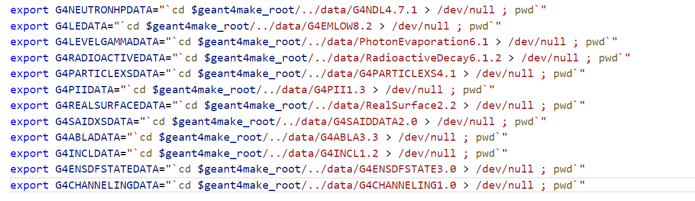
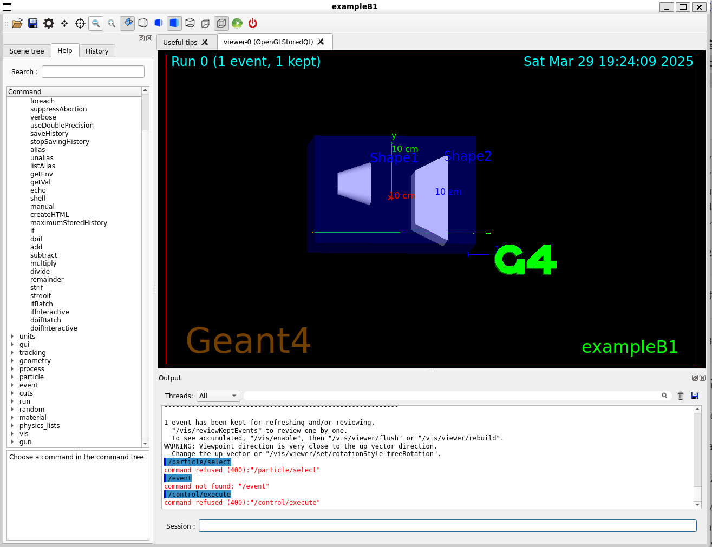

# Linux下的Geant4安装

## 1 WSL2和Ubuntu-22.04
- 控制面板 -> 程序和功能 -> 启用或关闭Windows功能，勾选“适用于Linux的Windows子系统”以及“虚拟机平台”，重启

- 管理员身份运行powershell
```bash
wsl --set-default-version 2

wsl --update

wsl --shutdown
```

- Microsoft store搜索下载“Ubuntu 22.04.x LTS”，设置用户名和密码；

-设置root
```bash
sudo passwd root
// 设置密码
// 后续只用su命令，输入密码进入root
```

- VScode下载WSL插件，`ctrl shift P`选择“连接WSL”

## 2 Geant4
### Preview
- gcc安装
```bash
sudo apt-get install build-essential
```

- openssl安装
```
sudo apt-get install libssl-dev
```

- cmake安装
```bash
wget http://www.cmake.org/files/v3.28/cmake-3.28.3.tar.gz //打开该网址找到该压缩文件并下载
tar -xvf cmake-3.28.3.tar.gz //对该压缩文件解压
cd cmake-3.28.3
./configure
make -j24
sudo apt-get install checkinstall 
sudo checkinstall //无脑回车即可
sudo make install
```
- 在geant4文件中安装clhep
```bash
cd /home
mkdir geant4
cd geant4

wget https://proj-clhep.web.cern.ch/proj-clhep/dist1/clhep-2.4.7.1.tgz
tar -xvf ./clhep-2.4.7.1.tgz
cd 2.4.7.1
mkdir build
cd build
cmake ../CLHEP 
make -j24
sudo make install
```
- 安装Expat与Zlib
```bash
sudo apt-get install -y libexpat-dev
sudo apt install -y zlib1g-dev
```

- 在geant4文件夹中安装xerce
```bash

cd /home/geant4
wget https://dlcdn.apache.org//xerces/c/3/sources/xerces-c-3.3.0.tar.gz
tar -xvf ./xerces-c-3.3.0.tar.gz
cd xerces-c-3.3.0
mkdir build
cd build
cmake ../
make -j24
make test
sudo make install

```

- 在geant4文件夹中安装qt

    - 先到qt官网申请个账号

    - 先下载[`qt-opensource-linux-x64-5.14.2.run`]( https://pan.baidu.com/s/1VyiY70Nj_MdrrdLvniXqcw)，密码g2n5

    - win和linux文件复制,假设你要将 `C:\Users\YourUsername\Documents\file.txt` 移动到 WSL 中的 `/home/yourusername/` 目录下：
        ```bash
        cp /mnt/c/Users/YourUsername/Documents/file.txt /home/yourusername/
        ```
    - 运行安装.run文件
        ```bash
        chmod +x qt-opensource-linux-x64-5.14.2.run
        ./qt-opensource-linux-x64-5.14.2.run
        ```
    - 可视化界面下安装，登录账号，勾选协议，一路next，安装路径选择`/home/geant4/Qt5`(新建)
    - 安装包勾选Qt目录下的`5.14.2`的所有，开始install

- 继续安装qt相关的包并进行配置
```bash
sudo apt-get install qt5-qmake
sudo apt-get install qtbase5-dev

sudo apt-get install -y vim
sudo apt-get install -y gedit
cd /usr/lib/x86_64-linux-gnu/qt-default/qtchooser
sudo gedit default.conf
```

- gedit可视化界面显示后，末尾写入以下指令并保存
```bash
/home/geant4/Qt5/5.14.2/gcc_64/bin
/home/geant4/Qt5/5.14.2/gcc_64
```

- qmake设置
```bash
sudo gedit /etc/profile
// 可视化界面打开后写入以下指令
export QTDIR=/home/geant4/Qt5/5.14.2/gcc_64
export PATH=$QTDIR/bin:$PATH
export LD_LIBRARY_PATH=$QTDIR/lib:$LD_LIBRARY_PATH
```

- 继续运行以下
```bash
sudo apt-get install -y dpkg
sudo apt-get install -y libgl1-mesa-dev 
sudo apt-get install -y libglu1-mesa-dev 
sudo apt-get install -y libx11-dev libxmu-dev 
sudo apt-get install -y libmotif-dev
sudo apt-get install -y freeglut3 freeglut3-dev binutils-gold
sudo apt-get install -y libcanberra-gtk-module
```
### G4 Install
- 为cmake指定寻找qt库的路径:
```bash
export CMAKE_PREFIX_PATH=home/geant4/Qt5/5.14.2/gcc_64/lib/cmake
sudo apt-get install build-essential apt-file gcc g++ autoconf automake automake1.11 tcl8.6-dev tk8.6-dev libglu1-mesa-dev libgl1-mesa-dev libxt-dev libxmu-dev libglew-dev libglw1-mesa-dev gfortran inventor-dev libxaw7-dev freeglut3-dev libxerces-c-dev libxmltok1-dev libxi-dev libclutter-gtk-1.0-0 cmake libxmlrpc-core-c3-dev tclxml tclxml-dev libexpat1-dev libgtk2.0-dev libxpm-dev x11proto-gl-dev x11proto-input-dev -y
 
sudo apt-get install qtbase5-dev qtchooser qt5-qmake qtbase5-dev-tools 
//Ubuntu21.04开始qt5-default包定位不到，需要安装上面几个包替代。 
```

- G4源码下载解压build

```bash
cd /home/geant4
wget ...
tar -xvf geant4-v11.3.1.tar.gz
mkdir geant4-v11.2.1-install
mkdir geant4-v11.2.1-build
cd geant4-v11.2.1-build //这一步一定要执行
sudo cmake -DCMAKE_INSTALL_PREFIX=/home/geant4/geant4-v11.2.1-install -DGEANT4_USE_OPENGL_X11=ON -DGEANT4_USE_RAYTRACE_X11=ON -DGEANT4_USE_GDML=ON -DGEANT4_INSTALL_DATA=OFF -DGEANT4_USE_QT=ON /home/geant4/geant4-v11.2.1
// DGEANT4_INSTALL_DATA=ON会自动下载data文件夹至home/geant4/geant4-v11.2.1-build文件夹中
// 速度太慢容易出错，建议OFF，make install 完成之后手动下载
sudo make -j24 //线程多死命薅
sudo make install
```
- 添加路径
```bash
gedit ~/.bashrc
// 末尾加以下两句
source  home/geant4/geant4-v11.2.1-install/bin/geant4.sh
source  home/geant4/geant4-v11.2.1-install/share/Geant4/geant4make/geant4make.sh
```
- 手动下载data包
查看geant4make.sh中的Datasets配置：



根据版本信息在官网把包全部下载下来后，`cp`命令复制到`home/geant4/geant4-v11.3.1-install/share/Geant4-11.3.1/data`并解压

- 此处有坑，G4EMLOW这个包网站首页没有下载地址，点击[此处](https://drive.google.com/drive/folders/1Q56UyTUp8c1dDYxmid3RjsoQRfGuzpGW?usp=drive_link)下载


### 运行测试

```bash
cd home/geant4/geant4-v11.3.1/examples/basic/B1
mkdir build
cd build/
source ~/.bashrc
cmake ../
make -j24
```
编译成功后进build找可执行文件`exampleB1`,执行
```bash
exampleB1
```
出现以下gui说明安装成功：




