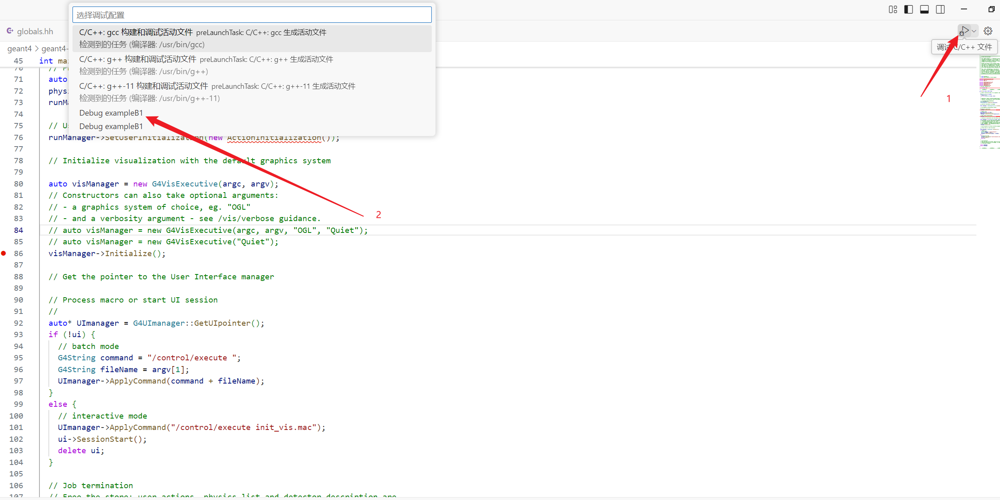

1. 重编译geant4，ccmake把build_type → Debug: make、make instal

2. ```sh
   sudo apt-get install gdb
   ```

3. 又报nm些莫名其妙的错：

   ```
   Available UI session types: [ Qt, tcsh, csh ]
   qt.qpa.plugin: Could not find the Qt platform plugin "xcb" in ""
   This application failed to start because no Qt platform plugin could be initialized. Reinstalling the application may fix this problem.
   ```

   找不到xcb，configure QT的时候加-xcb

4. 重新编译geant4之后不知道为什么example B1.cc中的只能指针UImanager又不能被识别了，查阅其他文件后加一行

   ```cpp
   auto* UImanager = G4UImanager::GetUIpointer();
   ```

5. 配置.vscode

6. - launch.json

     ```json
     {
       "version": "0.2.0",
       "configurations": [
         {
           "name": "Debug exampleB1",
           "type": "cppdbg",
           "request": "launch",
           "program": "/home/geant4/geant4-v11.3.1/examples/basic/B1/build/exampleB1",
           "args": [],
           "stopAtEntry": false,
           "cwd": "/home/geant4/geant4-v11.3.1/examples/basic/B1/build",
           "environment": [   //注意看路径，name和路径里的数据文件value可能不一样，运行没问题，调试时容易找不到，environment显式指定
                {
                    "name": "G4ABLADATA",
                    "value": "/home/fanghaodu/.conda/envs/geant4/share/Geant4/data/ABLA3.3"
                },
                {
                    "name": "G4LEDATA",
                    "value": "/home/fanghaodu/.conda/envs/geant4/share/Geant4/data/EMLOW8.6.1"
                },
                {
                    "name": "G4NEUTRONHPDATA",
                    "value": "/home/fanghaodu/.conda/envs/geant4/share/Geant4/data/NDL4.7.1"
                },
                {
                    "name": "G4PARTICLEXSDATA",
                    "value": "/home/fanghaodu/.conda/envs/geant4/share/Geant4/data/PARTICLEXS4.1"
                },
                {
                    "name": "G4PIIDATA",
                    "value": "/home/fanghaodu/.conda/envs/geant4/share/Geant4/data/PII1.3"
                },
                {
                    "name": "G4RADIOACTIVEDATA",
                    "value": "/home/fanghaodu/.conda/envs/geant4/share/Geant4/data/RadioactiveDecay6.1.2"
                },
                {
                    "name": "G4REALSURFACEDATA",
                    "value": "/home/fanghaodu/.conda/envs/geant4/share/Geant4/data/RealSurface2.2"
                },
                {
                    "name": "G4SAIDXSDATA",
                    "value": "/home/fanghaodu/.conda/envs/geant4/share/Geant4/data/SAIDDATA2.0"
                },
                {
                    "name": "G4INCLDATA",
                    "value": "/home/fanghaodu/.conda/envs/geant4/share/Geant4/data/INCL1.2"
                },
                {
                    "name": "G4LEVELSDATA",
                    "value": "/home/fanghaodu/.conda/envs/geant4/share/Geant4/data/PhotonEvaporation6.1"
                },
                {
                    "name": "G4ENSDFSTATEDATA",
                    "value": "/home/fanghaodu/.conda/envs/geant4/share/Geant4/data/ENSDFSTATE3.0"
                },
                {
                    "name": "G4CHANNELINGDATA",
                    "value": "/home/fanghaodu/.conda/envs/geant4/share/Geant4/data/CHANNELING1.0"
                }
            ],
           "externalConsole": false,
           "MIMode": "gdb",
           "miDebuggerPath": "/usr/bin/gdb",
           "setupCommands": [
                {
                    "description": "Enable pretty printing",
                    "text": "-enable-pretty-printing",
                    "ignoreFailures": true
                },
                {
                    "description": "Set GDB to use Python pretty printers",
                    "text": "python import sys; sys.path.insert(0, '/usr/share/gcc/python'); from libstdcxx.v6.printers import register_libstdcxx_printers; register_libstdcxx_printers(None)",
                    "ignoreFailures": true
                },
                {
                    "description": "Set Disassembly Flavor",
                    "text": "-gdb-set disassembly-flavor intel",
                    "ignoreFailures": true
                }
            ],
         },
     
     
         {
           "name": "Debug Gate with benchPET.mac",
           "type": "cppdbg",
           "request": "launch",
           "program": "/home/gate/gate-9.4.1-install/bin/Gate",
           "args": ["benchPET.mac"],
           "stopAtEntry": false,
           "cwd": "/home/gate/Gate-9.4.1/benchmarks/benchPET",
           "environment": [],
           "externalConsole": false,
           "MIMode": "gdb",
           "miDebuggerPath": "/usr/bin/gdb",
           "setupCommands": [
             {
               "description": "Enable pretty-printing for gdb",
               "text": "-enable-pretty-printing",
               "ignoreFailures": true
             }
           ]
         },
       ]
     }
     
     ```

     

   - task.json

     ```json
     {
       "version": "2.0.0",
       "tasks": [
         {
           "label": "build",
           "type": "shell",
           "command": "cmake --build build",
           "group": {
             "kind": "build",
             "isDefault": true
           }
         }
       ]
     }
     
     ```

7. 重新编译B1

   ```
   cmake -DCMAKE_EXPORT_COMPILE_COMMANDS=ON -DCMAKE_BUILD_TYPE=Debug
   ```

8. 

   就可以查看调试信息了，gate同理哦

