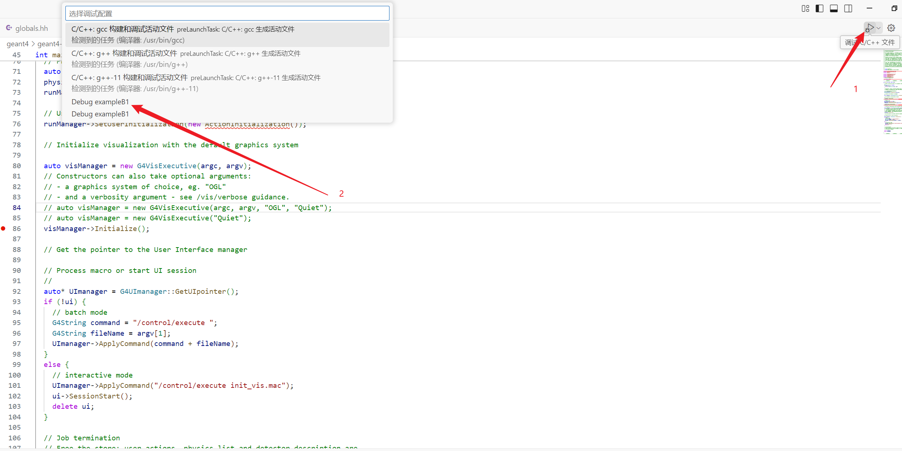

1. 重编译geant4，ccmake把build_type → Debug: make、make instal

2. ```sh
   sudo apt-get install gdb
   ```

3. 又报nm些莫名其妙的错：

   ```
   Available UI session types: [ Qt, tcsh, csh ]
   qt.qpa.plugin: Could not find the Qt platform plugin "xcb" in ""
   This application failed to start because no Qt platform plugin could be initialized. Reinstalling the application may fix this problem.
   ```

   找不到xcb，configure QT的时候加-xcb

4. 重新编译geant4之后不知道为什么example B1.cc中的只能指针UImanager又不能被识别了，查阅其他文件后加一行

   ```cpp
   auto* UImanager = G4UImanager::GetUIpointer();
   ```

5. 配置.vscode

6. - launch.json

     ```json
     {
       "version": "0.2.0",
       "configurations": [
         {
           "name": "Debug exampleB1",
           "type": "cppdbg",
           "request": "launch",
           "program": "/home/geant4/geant4-v11.3.1/examples/basic/B1/build/exampleB1",
           "args": [],
           "stopAtEntry": false,
           "cwd": "/home/geant4/geant4-v11.3.1/examples/basic/B1/build",
           "environment": [],
           "externalConsole": false,
           "MIMode": "gdb",
           "miDebuggerPath": "/usr/bin/gdb",
           "setupCommands": [
             {
               "description": "Enable pretty-printing for gdb",
               "text": "-enable-pretty-printing",
               "ignoreFailures": true
             }
           ]
         },
     
     
         {
           "name": "Debug Gate with benchPET.mac",
           "type": "cppdbg",
           "request": "launch",
           "program": "/home/gate/gate-9.4.1-install/bin/Gate",
           "args": ["benchPET.mac"],
           "stopAtEntry": false,
           "cwd": "/home/gate/Gate-9.4.1/benchmarks/benchPET",
           "environment": [],
           "externalConsole": false,
           "MIMode": "gdb",
           "miDebuggerPath": "/usr/bin/gdb",
           "setupCommands": [
             {
               "description": "Enable pretty-printing for gdb",
               "text": "-enable-pretty-printing",
               "ignoreFailures": true
             }
           ]
         },
       ]
     }
     
     ```

     

   - task.json

     ```json
     {
       "version": "2.0.0",
       "tasks": [
         {
           "label": "build",
           "type": "shell",
           "command": "cmake --build build",
           "group": {
             "kind": "build",
             "isDefault": true
           }
         }
       ]
     }
     
     ```

7. 重新编译B1

   ```
   cmake -DCMAKE_EXPORT_COMPILE_COMMANDS=ON -DCMAKE_BUILD_TYPE=Debug
   ```

8. 

   就可以查看调试信息了，gate同理哦

